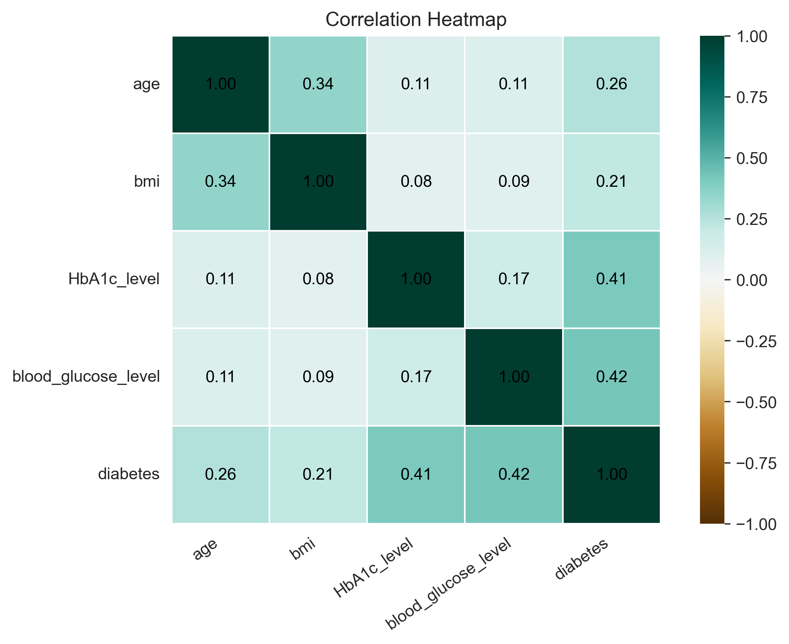

# Diabetes Prediction Analysis

---

## Overview

This project explores a real-world dataset to predict diabetes based on patient health indicators. It includes data cleaning, exploratory data analysis (EDA), and classification models, all visualized and explained using Python.

---

## Dataset

- **Source**: [Kaggle - Diabetes Prediction Dataset](https://www.kaggle.com/datasets/iammustafatz/diabetes-prediction-dataset)
- `diabetes_prediction_analysis.ipynb`: Jupyter Notebook containing the full analysis, visualizations, and model training.
- `visuals`: Saved figures from the notebook for easier reference or presentations.

---

## Tools Used

- Python (Pandas, Matplotlib, Seaborn, Scikit-learn)
- Jupyter Notebook

---

## Project Workflow

### 1. **Data Cleaning**
- Removed duplicates
- Checked and flagged outliers (kept for medical relevance)
- Encoded categorical features

### 2. **Exploratory Data Analysis (EDA)**
- Plotted distributions and trends for all variables
- Analyzed diabetes rates by gender, age, BMI, HbA1c level, and more
- Created summary visualizations and a correlation heatmap

### 3. **Modeling**
- Trained two classification models:
  - **Logistic Regression**
  - **Random Forest Classifier**
- Evaluated using:
  - Accuracy, Precision, Recall, F1-score
  - ROC AUC score and ROC curves

---

## Key Insights

- **Only 8.8% of people in the dataset had diabetes,** which means the data was imbalanced and made predicting positive cases more challenging.
- People with **higher HbA1c and blood glucose levels** were much more likely to be diabetic.
- **BMI** and **age** also showed a clear relationship with diabetes risk.
- **Former smokers**, people with **heart disease**, and those with **hypertension** had higher diabetes rates.
- The strongest correlations with diabetes were:
  - `blood_glucose_level`: **0.42**
  - `HbA1c_level`: **0.41**
  - `age`: **0.26**
  - `BMI`: **0.21**

These patterns align with real medical knowledge and help build trust in the model’s output.

---

## Conclusion

This project shows which health factors are most linked to diabetes and how machine learning can help spot it early. The Random Forest model was the best choice because it found more diabetic cases while still being accurate overall.

Thank you for checking out my project!
